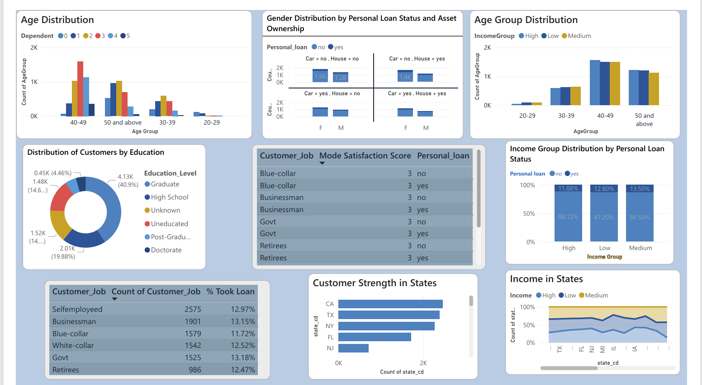

# Credit-Card-Customer-Transaction-Analytics-Dashboard
This project analyzes credit card customer and transaction datasets to uncover spending behavior, revenue trends, and customer demographics. Using Power BI, interactive dashboards were built to visualize key financial metrics such as transaction volume, customer segmentation, and spending categories. 

## Dashboard
## 📊 Customer Analytics Dashboard

